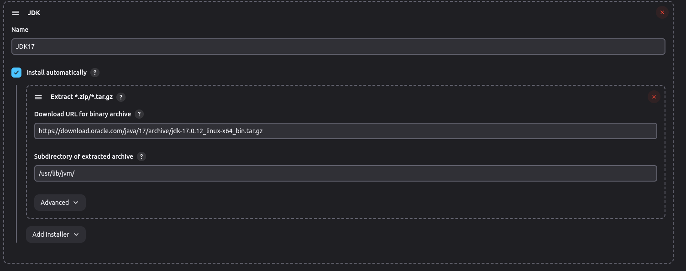
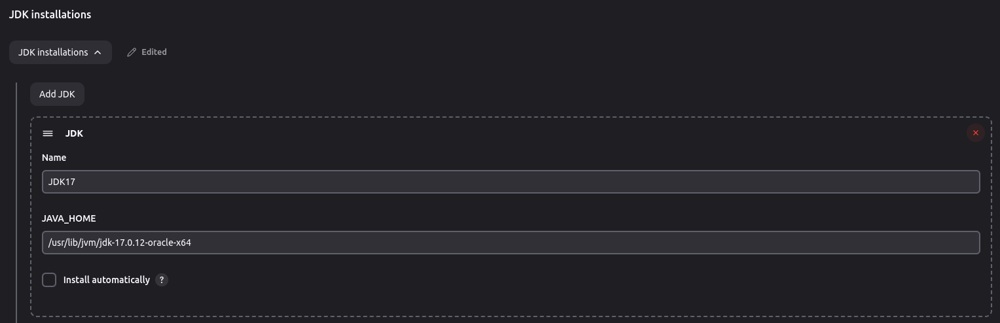
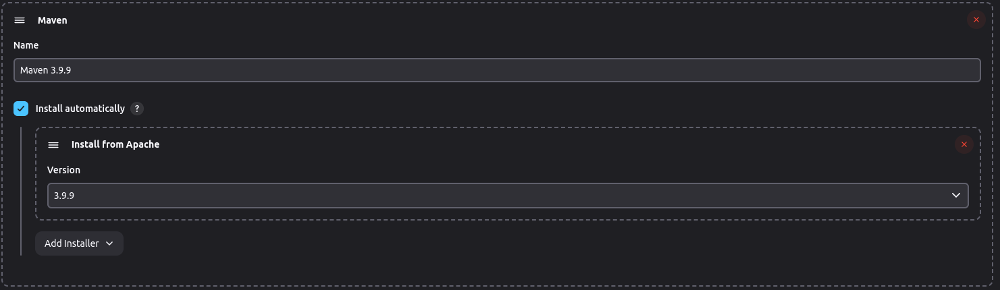
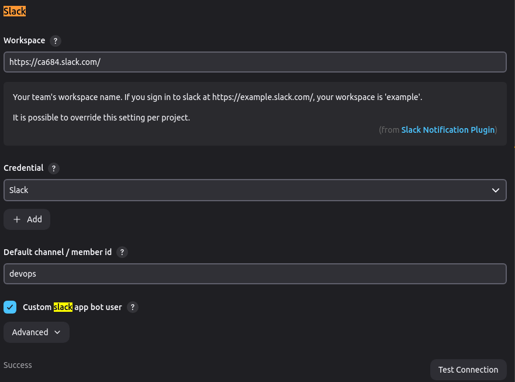

# Configuration Steps


# Local Machine 

##  Installing the server on docker

The steps are taken from the below site and run with little modification
https://www.jenkins.io/doc/book/installing/docker/


#### Step 1: Create the docker network 

```bash 
docker network create devops_tools
```
#### step 2: Create the jenkins Volume bind directory

```bash
mkdir /var/tmp/jenkins-data
```

#### Step 3: Run Jenkins inside the docker
```bash
docker run \
  --name jenkins-docker \
  --detach \
  --privileged \
  --network devops_tools \
  --network-alias jenkins-docker \
  --env DOCKER_TLS_CERTDIR=/certs \
  --volume jenkins-docker-certs:/certs/client \
  --volume /var/tmp/jenkins-data:/var/jenkins_home \
  --publish 2376:2376 \
  docker:dind \
  --storage-driver overlay2
```

#### Step 4: Create a Jenkins Docker image

Copy the content to a file
``` bash
FROM jenkins/jenkins:2.462.3-jdk17
USER root
RUN apt-get update && apt-get install -y lsb-release
RUN curl -fsSLo /usr/share/keyrings/docker-archive-keyring.asc \
  https://download.docker.com/linux/debian/gpg
RUN echo "deb [arch=$(dpkg --print-architecture) \
  signed-by=/usr/share/keyrings/docker-archive-keyring.asc] \
  https://download.docker.com/linux/debian \
  $(lsb_release -cs) stable" > /etc/apt/sources.list.d/docker.list
RUN apt-get update && apt-get install -y docker-ce-cli
USER jenkins
RUN jenkins-plugin-cli --plugins "blueocean docker-workflow"
```

Build the image
```bash
docker build -t myjenkins-blueocean:2.462.3-1 .
```

#### Step 5: Run the customized image
```bash
docker run \
  --name jenkins-blueocean \
  --restart=on-failure \
  --detach \
  --network devops_tools \
  --env DOCKER_HOST=tcp://jenkins-docker:2376 \
  --env DOCKER_CERT_PATH=/certs/client \
  --env DOCKER_TLS_VERIFY=1 \
  --publish 9001:8080 \
  --publish 50000:50000 \
  --volume /var/tmp/jenkins-data:/var/jenkins_home \
  --volume /var/tmp/jenkins-data/jenkins-docker-certs:/certs/client:ro \
  myjenkins-blueocean:2.462.3-1
```

##  Installing the server on VM


Server Config - Ubuntu VM

Refer: https://pkg.jenkins.io/debian-stable/


# Setup Details

### Step 1: Install the JDK 

1. Install the 'Oracle Java SE Development Kit Installer' Plugin from plugin section or go to  JDK download link(https://www.oracle.com/java/technologies/javase/jdk17-archive-downloads.html, https://docs.oracle.com/en/java/javase/11/install/installation-jdk-linux-platforms.html)
<!-- 2. Copy the link tar/gz accoding to the os
3. Go to Jenkins -- Manage Jenkins ---/> Tools
4. Configure the JDK like given in the image -->
2. Install java on the Jenkins server and node
```bash
wget https://download.oracle.com/java/17/archive/jdk-17.0.12_linux-x64_bin.deb
sudo dpkg -i jdk-17.0.12_linux-x64_bin.deb
```
3. Point the JDK in the global configuration as shown in the image


### Step 2: Install the Maven

1. Go to Jenkins -- Manage Jenkins ---> Tools
2. Configure the Maven like given in the image


### Step 3: Configuring Github Integration
1. Generate the ssh key pair on the nodes - server
```bash
ssh-keygen -t rsa -b 4096 -C 'jenkins github'
```
2. Copy the key from ~/.ssh/id_rsa.pub to the gihub setting ssh and gpg key

3. Check the connection
```bash
ssh -T git@github.com
```
4. Jenkins nodes will be able to connect to the github


### Step 4: Managed nodes - Master Salve
Why we need it
• Build jobs require resources, and they compete for resource availability
• A different runtime environment is required for different build jobs
• It distributes the load across slave nodes


1. Go to the Global jenkins setting and click on the Nodes
2. Configure a new node with the proper lables and tools(jdk)
3. install the agent on the node (Click on the status icon you will see the steps necessary)
4. Make sure whenever nodes restart it should automatically start agent - crontab -entry
```bash
java -jar agent.jar -url http://{ip}:8080/ -secret fed49945d8a2a62de3957cb1e91ac84aef2d9a80be4ea97ab3e736d9947df62f -name ubuntuNode -workDir ""
```
4. If you are getting following error go to Security ---> agent ---> Random and save
```bash
INFO: Could not locate server among [http://192.168.1.39:8080/]; waiting 10 seconds before retry
java.io.IOException: http://192.168.1.39:8080/tcpSlaveAgentListener/ is invalid: 404 Not Found

```


### Step 5: Setup the Notification - Slack 
Ref: https://plugins.jenkins.io/slack/
1. Create secrets
2. Follow the documentation
